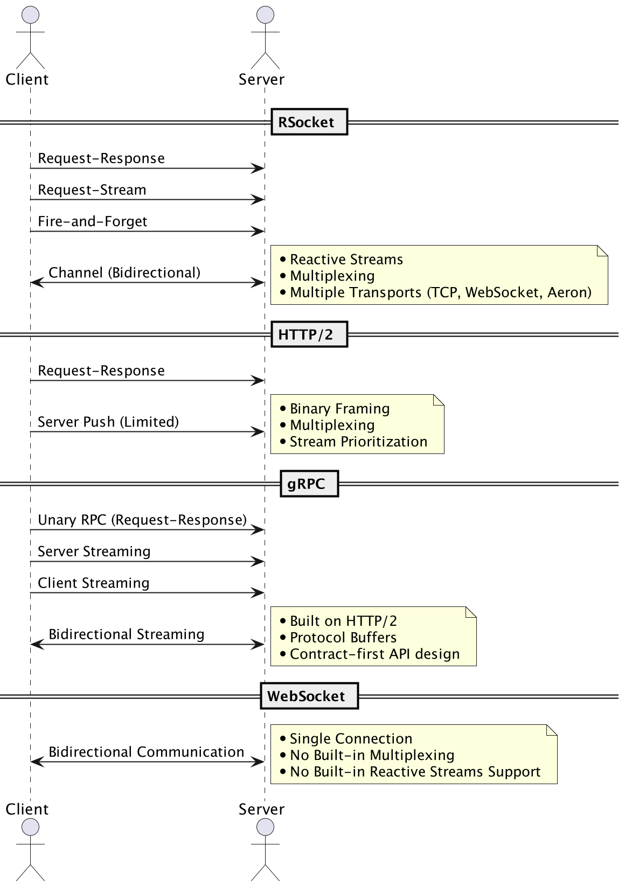

**1.4. Comparison with Other Protocols**

When compared to other protocols, RSocket has some unique advantages:

- HTTP/2: While HTTP/2 supports multiplexing and binary framing, it is still built on the request-response model, limiting its efficiency in scenarios where bidirectional communication is needed. RSocket, on the other hand, provides all four interaction models and follows the reactive streams specification, offering better handling of backpressure and resource utilization.

- gRPC: gRPC is a high-performance RPC (Remote Procedure Call) framework built on top of HTTP/2. It uses protocol buffers for efficient serialization and offers strong support for contract-first API design. While gRPC is efficient and well-suited for many use cases, it still relies on the request-response model of HTTP/2, which can limit its performance in scenarios where bidirectional communication and reactive streams are required. RSocket, on the other hand, offers all four interaction models and follows the reactive streams specification, making it a more flexible choice in such scenarios.

- WebSockets:WebSockets provide bidirectional communication between client and server over a single connection. However, they lack built-in support for multiplexing, flow control, and reactive streams. RSocket offers all of these features, making it a more robust and scalable solution for distributed systems communication.

When choosing a communication protocol for your application, consider the following factors:

 Performance requirements: If low latency and high throughput are critical for your use case, RSocket may offer better performance than HTTP/2 or gRPC.

 Bidirectional communication: If your application requires bidirectional communication, RSocket and WebSockets are more suitable choices than HTTP/2 or gRPC.

 Reactive programming: If your application benefits from reactive programming, RSocket's support for reactive streams can provide better resource utilization and backpressure handling compared to other protocols.

 Transport layer and language support: Evaluate the available transport layers and language support for each protocol, as this can impact the ease of integration and interoperability between different parts of your system.

In summary, RSocket is a powerful and flexible protocol that offers many advantages for distributed systems communication. Its support for reactive streams, bidirectional communication, and multiplexing make it an excellent choice for a wide range of use cases. However, it's essential to carefully evaluate your application's specific requirements and compare RSocket with other protocols like HTTP/2, gRPC, and WebSockets to determine the best solution for your needs.

